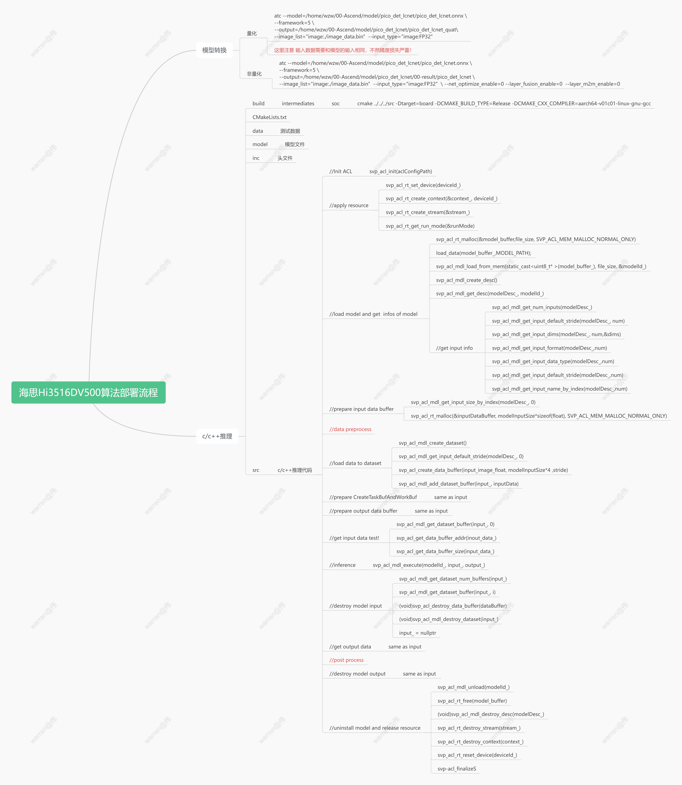

# 导出onnx模型
[paddle版面分析模型](https://github.com/PaddlePaddle/PaddleOCR/blob/release/2.7/ppstructure/layout/README_ch.md)
导出onnx
```bash
paddle2onnx --model_dir model/picodet_lcnet_x1_0_fgd_layout_cdla_infer \
--model_filename model.pdmodel \
--params_filename model.pdiparams \
--opset_version 11 \
--input_shape_dict="{'image':[1, 3, 960, 960]}" \
--save_file ./onnx_model/pico_det_lcnet_960.onnx
```
# 板端部署
## 模型转换onnx->om
1：准备pico_det的onnx模型--->
搭建好ATC的环境
[海思SS928搭建NNN环境并添加opencv库-CSDN博客](https://blog.csdn.net/warren103098/article/details/132838311?csdn_share_tail={)
首先设置环境变量
source /home/warren/Ascend/ascend-toolkit/latest/x86_64-linux/bin/setenv.bash
## 转化模型
### 量化
```bash
atc --model=/home/wzw/00-Ascend/model/pico_det_lcnet/pico_det_lcnet.onnx \
--framework=5 \
--output=/home/wzw/00-Ascend/model/pico_det_lcnet/pico_det_lcnet_quat\
--image_list="image:./image_data.bin" --input_type="image:FP32"
```
### 不量化
```bash
atc --model=/home/wzw/00-Ascend/model/pico_det_lcnet/pico_det_lcnet.onnx \
--framework=5 \
--output=/home/wzw/00-Ascend/model/pico_det_lcnet/00-result/pico_det_lcnet \
--image_list="image:./image_data.bin" --input_type="image:FP32"  \ --net_optimize_enable=0 --layer_fusion_enable=0  --layer_m2m_enable=0
```
# 推理代码编写
## 部署代码逻辑

[Hi3516DV500 SVP_NNN添加opencv库记录](http://t.csdnimg.cn/AqZXJ) 
```bash
mkdir -p build/intermediates/soc
cd build/intermediates/soc
cmake ../../../src -Dtarget=board -DCMAKE_BUILD_TYPE=Release 
-DCMAKE_CXX_COMPILER=aarch64-v01c01-linux-gnu-gcc
make
```


## 关于作者
* warren@伟
* 个人博客：具体内容可以参考我的博客[CSDN-warren@伟](https://blog.csdn.net/warren103098?type=blog)